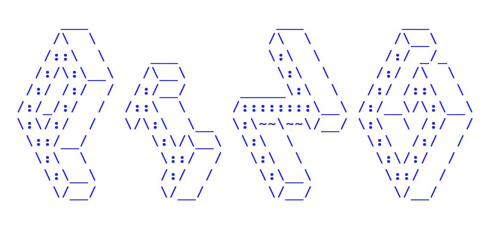

PING
====

## Presentation 

*This is a prototype version of PING. PING is curently in developpment.*

PING (Ping Is Not Googledocs) is a numeric tool for sharing notes taking in real time, without disturbing note takers. PING allows a personal note taking, and at the same time, a visualization of others' notes. 
The goal of this polling is to produce a common and shareable document, increased by everyone's work. 
PING's challenge is to modify the way we are taking notes and the way we are sharing knowledges by putting forward the knowledge of everyone.
The audience is not a simple consummer of a speach, but we are its co creator. We are active and enriched by collective knowledges.

---

## Installing the demo

### Clone the repo or download it
To download the repository, click on the "Download zip" button on the dodoc Github page

To clone the repository open the terminal and type this command  
			git clone https://github.com/sarahgarcin/ping-v2.git

### Install nodejs on your computer

You can install nodejs from this page https://nodejs.org/
Then, verify that it is correctly installed by typing in the terminal
		node -v

### Install dependencies

In terminal go to the ping directory you have just cloned or downloaded:
cd path/of/the/ping/directory

Once you are in the right directory
Enter the command:
		npm install

## Run Ping in browser

In the right directory
Run the server in the terminal
		node server.js

Go to browser and go to the url
http://localhost:1337

---

## About

This project is under GNU GENERAL PUBLIC LICENSE.
Created by Sarah Garcin and Victor Lebeau

